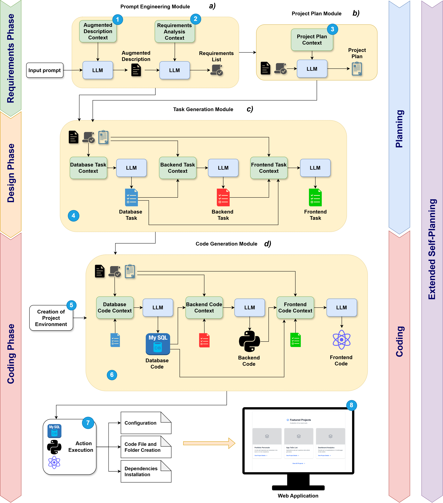

# BrainDev AI – Generated Web Application Outputs (Gemini 2.5 Pro)

This repository contains the complete set of artifacts produced during a single **end-to-end web application generation** using **BrainDev AI** with **Gemini 2.5 Pro** as the underlying Large Language Model.

The repository is intended to support **reproducibility, transparency, and qualitative inspection** of the generation pipeline described in the associated research paper. All outputs correspond to the execution of the framework on a real-world prompt and are provided *as-is*, without manual post-editing.

---

## 1. Purpose of the Repository

The goal of this repository is to:

- Provide a **full trace of the generation process**.
- Expose intermediate reasoning and planning artifacts produced by the framework.
- Enable researchers to analyze how high-level natural language requirements are progressively transformed into a complete full-stack web application.
- Support qualitative and structural evaluation beyond traditional snippet-level benchmarks.

---

## 2. Model and Configuration

- **Large Language Model:** Gemini 2.5 Pro  
- **Framework:** BrainDev AI  
- **Methodology:** Extended Self-Planning  

All outputs were generated in a single run of the framework.

---

## 3. Repository Structure

The repository contains a set of text files, each corresponding to the output of a specific module in the BrainDev AI pipeline: Prompt Engineering Module, Project Plan Module, Taks Generation Module and Code generation Module.

Each file represents the **direct output of one pipeline stage**, in the exact order executed by the framework.

---

## 4. Evaluation Context

The artifacts in this repository are used as input for the evaluation methodology described in the associated paper (Structural and Functional Coherence Evaluation SFCEval).

In the file SFCEval.txt are shown all the specifics

